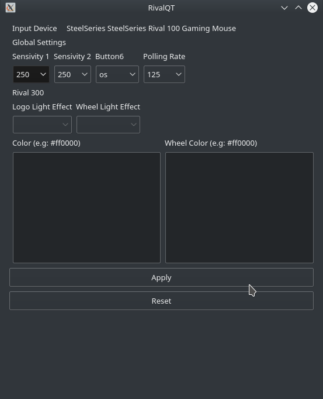

# RivalQt: Configure SteelSeries gaming mice with Qt Gui

Supported mices:

* SteelSeries Rival 100 _(1038:1702)_
* SteelSeries Rival 110 _(1038:1729)_ (not tested)
* SteelSeries Rival 300 _(1038:1710)_ (not tested)
* SteelSeries Rival 300 CS:GO Fade Edition _(1038:1394)_ (not tested)
* SteelSeries Rival 300 CS:GO Hyperbeast Edition _(1038:171a) (not tested)

If you have trouble running this software, please open an issue on Github:

* https://github.com/oguzbakir/RivalQt/issues

## Requirement

* Any Linux distribution that use `udev` (Debian, Ubuntu, ArchLinux,
  Fedora,...)
* [hidapi](https://pypi.python.org/pypi/hidapi/0.7.99.post20)

## Installation

### Prerequisites

**Linux:**

Installation require a compilation toolchain, Qt5 and rivalcfg to compile
`hidapi`. On Debian / Ubuntu, this can be installed with the following command
(as root):

### Installing build tools

Run the following command (as root):

    apt-get install build-essential

### Installing Qt5

Run the following command (as root):

    wget http://download.qt.io/official_releases/qt/5.9/5.9.6/qt-opensource-linux-x64-5.9.6.run
    chmod +x qt-opensource-linux-x64-5.9.6.run
    ./qt-opensource-linux-x64-5.9.6.run

### Installing rivalcfg

Run the following command (as root):

    pip install rivalcfg

### Screenshots

